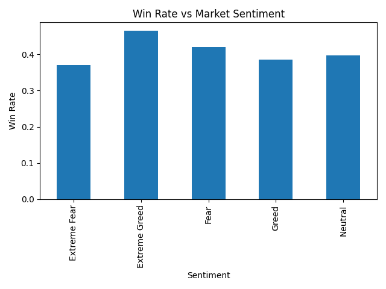

# Trader Performance Analysis using Market Sentiment

## Overview

This project analyzes the relationship between trader performance and market sentiment using historical trading data and the Fear & Greed Index.

The goal of this analysis is to understand how market sentiment (Fear, Greed, Neutral, Extreme Fear, Extreme Greed) affects trader profitability and win rate.

This project was completed as part of a data science assignment to explore real-world trading data and generate insights using Python and Pandas.

---

## Dataset

Two datasets were used:

### 1. Fear & Greed Index Dataset
Contains daily market sentiment values.

Columns:
- date
- classification (Fear, Greed, etc.)
- value (index value)

### 2. Historical Trading Dataset
Contains trader execution data.

Columns include:
- Account
- Coin
- Execution Price
- Size USD
- Side (BUY / SELL)
- Closed PnL
- Timestamp
- Direction

---

## Steps Performed

- Loaded both datasets using Pandas
- Cleaned column names
- Converted timestamps to date format
- Merged sentiment data with trade data
- Created profit / loss indicator
- Calculated win rate by sentiment
- Calculated total PnL by sentiment
- Visualized results using Matplotlib

---

## Key Analysis

We analyzed:

- Win Rate vs Market Sentiment
- Profit vs Market Sentiment
- Trader performance under Fear / Greed conditions
- Direction based performance

---

## Results

### Win Rate vs Market Sentiment

This graph shows how trader win rate changes depending on market sentiment.

Observation:

- Extreme Greed shows higher win rate
- Neutral sentiment shows lower performance
- Market sentiment affects trader success rate

---

## Tech Used

- Python
- Pandas
- NumPy
- Matplotlib
- Seaborn
- Jupyter Notebook

---

## Project Structure
trader_analysis/
│
├── data/
│ ├── fear_greed_index.csv
│ ├── historical_data.csv
│
├── images/
│ └── winrate_vs_sentiment.png
│
├── traders_analysis.ipynb
├── report.txt
├── README.md

---

## Conclusion

Market sentiment has a noticeable impact on trader performance.

Win rate and profit vary across Fear / Greed conditions, showing that trader behavior is influenced by overall market psychology.

This analysis demonstrates how real trading data can be used to generate useful insights using Python.

---

## Author

Esakki Raja P  
AI & ML Student  
GitHub: https://github.com/Raja-ML-22